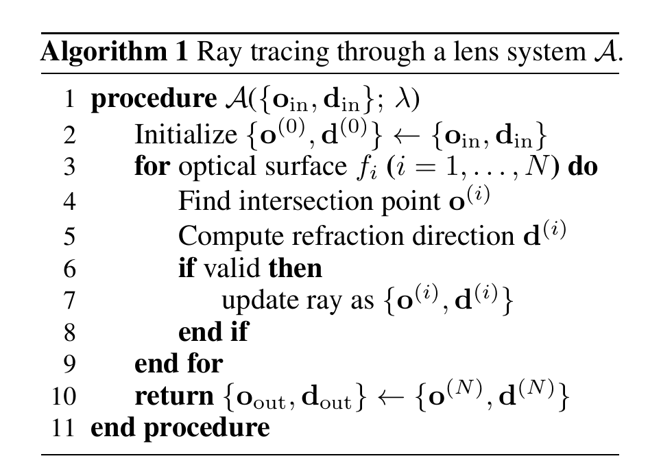

# imaging_sim
Angle-grid ray tracing from an on-axis point source to PSF on the sensor
## General Consideration
We consider three things in this design: 
- Lens modeling
- Rendering
- **Scability**
### Lens modeling
We use a Zemax-style **Surface Data Table** to align with lens settings.

Here is an explanation of different components.

---
| Column       | Meaning              | Description                                                                                           |
| ------------ | -------------------- | ----------------------------------------------------------------------------------------------------- |
| **Type**     | Surface type         | `O` = Object, `S` = Surface, `A` = Aperture/Stop, `I` = Image                                         |
| **Distance** | Thickness / spacing  | Physical distance to the next surface (in mm)                                                         |
| **ROC**      | Radius of curvature  | Positive = center to the right (convex left); negative = center to the left (concave right); 0 = flat |
| **Diameter** | Clear aperture       | Effective aperture or surface diameter (in mm)                                                        |
| **Material** | Medium or glass type | Optical material (e.g., BK7, SSK4, SK1, F15, SK16, VACUUM)                                                 |
---

To match Thorlabs **LB1761** (simple BK7 biconvex singlet), we map \[R1, T, R2, D2, OD\] (mm) as:

- **R1 = 24.5**, **T = 9**, **R2 = −24.5**, **D2 = 22.2**, **OD = 3.175** (≈ f/8)

Parameter table:

---
| # | Type  | Distance (mm) | ROC (mm) | Diameter (mm) | Material |
| - | ----- | ------------- | -------- | ------------- | -------- |
| 1 | **O** | 0.000         | 0.000    | 0.000         | AIR      |
| 2 | **S** | 0.000         | 24.5     | 25.4          | BK7    |
| 3 | **S** | 9.000         | -24.5    | 25.4          | AIR      |
| 4 | **A** | 0.000         | 0.000    | 3.175         | OCCLUDER |
| 5 | **I** | 22.200        | 0.000    | 25.4          | AIR      |
---

## Rendering
Here, the task is to simulate PSF, but we also consider about the rendering of the images if we have some time for extenstion.

We took the following steps:

## Extension
Consider the shift of the lens, etc.

## Code design:
Consider three components:
- Material
- Lens
- RayTracing
## Reference:
- Wang, Congli, Ni Chen, and Wolfgang Heidrich. "do: A differentiable engine for deep lens design of computational imaging systems." IEEE Transactions on Computational Imaging 8 (2022): 905-916.
- Ho, Chi-Jui, et al. "A Differentiable Wave Optics Model for End-to-End Computational Imaging System Optimization." arXiv preprint arXiv:2412.09774 (2024).

