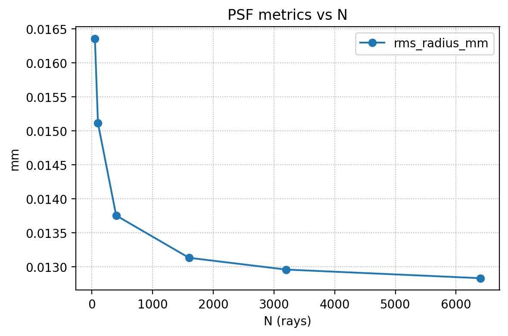
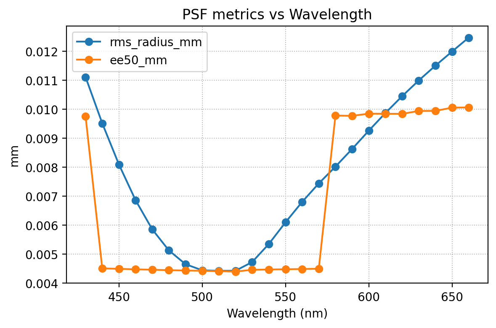
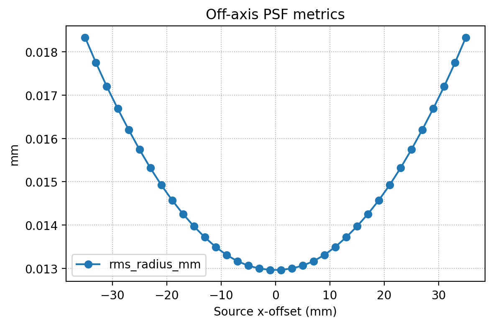

# Experiment

FFor the evaluation of the results, we consider the Thorlabs LB1761 (a simple N-BK7 biconvex singlet lens) and perform a simulation using an f/8 aperture placed 2 mm  from the second lens surface. We map \[R1, T, R2, D2, OD\] (mm) as:

**R1 = 24.5**, **T = 9**, **R2 = −24.5**, **D2 = 22.2**, **OD = 3.175** (≈ f/8)

We only use **OD = 6.25 mm** for Off-axis sweep and field_grid sweep.

We conducted following experiment:

- Function test
- Layout & Ray visualization
- Best bocus estimation
- Sampling number (N) sweep
- Wavelength ($\lambda$) sweep
- Through-focus (D2) sweep
- Aperture sweep (OD)
- Off-axis sweep

Futher, we consider a double Gaussian Lens  [US253251A](https://patents.google.com/patent/US2532751), and conducted following experiments

- Wavelength ($\lambda$) sweep
- Off-axis sweep

### Function Test
Function test was conducted in the tests folder, named as [test_geo.py](../tests/test_geo.py) and [test_ray_tracing.py](../tests/test_ray_tracing.py)
### Lens layout
The lens could be viewed as 

### Ray tracing
The ray tracing could be viewed as

### PSF Exmples
After optimization, we found that placing the sensor at **20.5 mm** after the aperture yields the best focus.

### N-sweep (sampling)
We sweeped N for **[50, 100, 400,1600,3200,6400]**, and calculated the **Metrics vs N**. 
To further examine the focus sensitivity, we use a lareger aperture **OD = 6.35** and repeated the PSF analysis. This deliberate defocus allows us to study how the spot size and energy distribution degrade when the image plane is displaced, providing a better understanding of depth-of-focus and system tolerance.

We illustrate the **N = 50, 400, 3200**, respectively and more to be found in the [folder](../out/sweep_N)

| N = 50 | N = 400 | N = 3200 |
|:-------:|:--------:|:---------:|
|  |   |    |

EE50 and RMS metrics are recorded in [metrics.csv](../out/sweep_N/metrics.csv) and ploted 

**Observation**: The convergence begins around N ≥ 1600, where the RMS and EE50 values stabilize to ~0.045 mm and ~0.021 mm, respectively — indicating sufficient ray sampling density for accurate PSF estimation. To get better simulation, we choose N=3200 for the rest of experiments.

### Wavelength Sweep

We sweep wavelength for **range(430 ,670, 10) nm**, a range of vible spectrum.
| lambda = 430 | lambda = 520 | lambda = 610 |
|:-------:|:--------:|:---------:|
|  |  |   |

EE50 and RMS metrics are recorded in [metrics.csv](../out/sweep_lambda/metrics.csv) and ploted 

**Observation**: With BK7 dispersion enabled, the smallest PSF occurs near ~500 nm and grows toward both spectral ends. This matches expectation: the effective focal length shifts with $\lambda$ (chromatic focus), so a single sensor position cannot be perfectly focused for all wavelengths.

### Through-focus (D2 sweep)

We sweep D2 for range **range (19.5,21.5,13) mm,**, the best focus is at 20.5

EE50 and RMS metrics are recorded in [metrics.csv](../out/sweep_D2/metrics.csv) and ploted 

**Observation**: As we move away from 20.5 mm (toward 20.33 or 20.66 and beyond), RMS and EE50 grow smoothly, indicating increasing defocus blur. The growth is slightly asymmetric—typical once real lens aberrations are present. The sweep cleanly identifies **20.5 mm** as the optimal aperture-to-sensor distance for this configuration, with predictable defocus behavior on either side.

### Aperture Sweep (OD)

We sweep OD: **1.5875 mm (f/16), 3.175 mm (f/8), 6.35 mm (f/4),12.7 mm (f/2)**

EE50 and RMS metrics are recorded in [metrics.csv](../out/sweep_OD/metrics.csv) and ploted 

**Observation**:As aperture increases from ~1.6→12.7 mm, the PSF’s core (EE50) stays nearly constant at small–moderate apertures while the halo (RMS) grows rapidly—and at the largest aperture both EE50 and RMS spike—so the sharpest results occur with small apertures (~1.6–3.2 mm).
### Off-axis sweep

We consider a larger aperture **6.35 mm (f/4)** for this experiment to have a better view of the results.

We illustrate the **N = 50, 400, 3200**, respectively and more to be found in the [folder](../out/sweep_N)
| Off axis = -11 mm | Off axis = 1 mm | Off axis = 11 mm|
|:-------:|:--------:|:---------:|
|  |  |   |

EE50 and RMS metrics are recorded in [metrics.csv](../out/offaxis/metrics.csv) and ploted 

**Observation**:As the source moves off-axis, the PSF centroid shifts roughly linearly with field while the core size stays nearly constant for small offsets, with only mild broadening/asymmetry (coma/astigmatism tails) appearing as the field angle increases.

## Discusion and Qualitative Analysis

### Sampling and Aliasing
When the ray sampling number N is small, the PSF exhibits visible speckle noise and non-smooth distribution.
This occurs because angularly uniform rays do not map evenly to the pupil, producing aliasing-like patterns.
As N increases beyond ~1600, both RMS and EE50 stabilize, and the PSF converges to a smooth shape.

To mitigate aliasing effects:

- Increase the number of rays or check convergence by metrics stability.

- Average multiple realizations with different random seeds to suppress stochastic artifacts.

- Sample uniformly on the pupil plane instead of emission angle.

### Off-Axis Source
As the source moves off-axis, the PSF centroid shifts linearly with field angle.
At small field angles, PSFs remain compact and symmetric.
At larger offsets, the PSF becomes asymmetric—displaying coma and astigmatism tails typical of rotationally symmetric singlets.
Additionally, the best-focus distance varies slightly across field points, suggesting mild field curvature.

This could be suppressed by using complex lens group.

### Wavelength Dependence (Chromatic Aberration)

With BK7 dispersion enabled, the refractive index 
$n(\lambda)$ decreases with wavelength, causing the effective focal length to increase as $\lambda$ becomes longer.
Hence, a fixed sensor plane cannot be perfectly focused for all wavelengths:

- Blue (short $\lambda$) focuses slightly in front of the nominal plane.

- Red (long $\lambda$) focuses behind it.

This produces the expected longitudinal chromatic aberration (LCA), observed in the $\lambda$-sweep where the smallest PSF occurs near 500 nm.
The pattern validates that BK7’s chromatic focus shifts are correctly modeled

### Aperture Effect (f-number)

As the aperture diameter OD increases from f/16 to f/2:

- The EE50 radius remains nearly constant at small apertures.

- The RMS radius increases rapidly at large apertures due to spherical aberration and off-axis coma.

This indicates a trade-off between brightness and sharpness:
smaller apertures (f/8–f/16) yield tighter PSFs and reduced aberrations,
while very large apertures (f/2) show blur halos and energy spread.

### Through-Focus Behavior

Sweeping sensor distance D₂ shows that PSF quality degrades smoothly as the plane moves away from best focus (20.5 mm).
The RMS and EE50 curves rise asymmetrically around the minimum, reflecting realistic lens aberrations and residual spherical terms.
This profile defines the depth-of-focus, and the slope steepens for larger apertures—matching theoretical expectations.

## Algorithmic Correction of Aberrations
Optical aberrations such as defocus, spherical aberration, coma, and astigmatism broaden the PSF and degrade contrast across the field.
From a computational imaging standpoint, these distortions can be modeled as a spatially varying blur kernel 
$h(x,y)$.

Both classical deconvolution and learning-based methods attempt to invert this degradation, but they differ fundamentally in assumptions, interpretability, and robustness.
| Aspect    | Classical Deconvolution                             | Neural Network Approach                          |
| :-------- | :-------------------------------------------------- | :----------------------------------------------- |
| Principle | Linear inversion (e.g., Wiener, RL) using known PSF | Data-driven mapping from blurred to sharp        |
| Pros      | Physically interpretable; predictable behavior; easy to regularize; no training data required.     | Can handle complex, non-paraxial, chromatic, or field-dependent aberrations; flexible and adaptive. |
| Cons      | Sensitive to noise and PSF mismatch; performance drops when aberrations vary across field.                | Requires training data, risk of overfitting    |
| Best use  | Mild blur, stationary PSF                           | Complex senarios, data-rich pipelines.        |

## Model Refinement and Efficiency

TO further refine the simulator.

Physical accuracy consideration:
- Include diffraction
- Model sensor pixel response, like microlens MTF
- Consider material tolerances, e.g. temperature change

Computation efficiency:
- Vectorize ray-surface intersection
- GPU acceleration

Function extension:
- Simulation for picture rendering
## Conclusion
The implemented simulator achieves its primary objectives and reproduces key optical behaviors of both the Thorlabs LB1761 biconvex lens and the extended Double-Gauss configuration.
Major outcomes and improvements include:

- Functional Enhancements

    - Added a PSF metrics module (RMS, EE50) for quantitative evaluation.

    - Corrected rendering alignment for even-sized pixel grids to eliminate half-pixel shifts.

    - Implemented sampling functions based on object distance for more flexible scene generation.

    - Introduced a build_lens() utility for parameter tuning and multi-surface configuration.

    - Simplified and modularized the overall code structure for clarity and maintainability.

    - Verified all major components through unit tests to ensure consistency.

- Validated Optical Behavior

    - Correct Snell refraction and ray–surface intersection across all simulations.

    - Convergent PSF metrics observed with sufficient ray sampling (N ≥ 1600).

    - Expected optical trends reproduced for wavelength, focus distance, aperture, and field angle.

