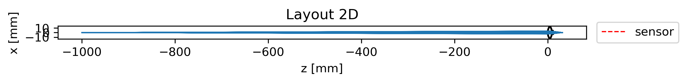

# Experiment

FFor the evaluation of the results, we consider the Thorlabs LB1761 (a simple N-BK7 biconvex singlet lens) and perform a simulation using an f/8 aperture placed 2 mm  from the second lens surface. We map \[R1, T, R2, D2, OD\] (mm) as:

**R1 = 24.5**, **T = 9**, **R2 = −24.5**, **D2 = 22.2**, **OD = 3.175** (≈ f/8)

We conducted following experiment:

- Function test
- Layout & Ray visualization
- Best bocus estimation
- Sampling number (N) sweep
- Wavelength (lambda) sweep
- Through-focus (D2) sweep
- Aperture sweep (OD)

Futher, we consider a double Gaussian Lens  [US253251A](https://patents.google.com/patent/US2532751), and conducted following experiments

- wavelength sweep
- sampling number (N) sweep
- Through-focus (D2) sweep

## Function Test
Function test was conducted in the tests folder, named as [test_geo.py](../tests/test_geo.py) and [test_ray_tracing.py](../tests/test_ray_tracing.py)
## Lens layout
The lens could be viewed as 

## Ray tracing
The ray tracing could be viewed as

## PSF Exmples
After optimization, we found that placing the sensor at **20.5 mm** after the aperture yields the best focus.

## N-sweep (sampling/)
We sweeped N for **[50, 100, 400,1600,3200,6400]**, and calculated the **Metrics vs N**. 
To further examine the focus sensitivity, we use a lareger aperture **OD = 6.35** and repeated the PSF analysis. This deliberate defocus allows us to study how the spot size and energy distribution degrade when the image plane is displaced, providing a better understanding of depth-of-focus and system tolerance.

We illustrate the **N = 50, 400, 3200**, respectively and more to be found in the [folder](../out/sweep_N)
| N = 50 | N = 400 | N = 3200 |
|:-------:|:--------:|:---------:|
|  |  |   |

Metrics EE50 and rms are:
|    N | ee50_mm | rms_radius_mm |
| ---: | :-----: | :-----------: |
|   50 | 0.00591 |    0.02611    |
|  100 | 0.00551 |    0.02455    |
|  400 | 0.00491 |    0.02282    |
| 1600 | 0.00465 |    0.02200    |
| 3200 | 0.00457 |    0.02177    |
| 6400 | 0.00453 |    0.02160    |

The convergence begins around N ≥ 1600, where the RMS and EE50 values stabilize to ~0.045 mm and ~0.021 mm, respectively — indicating sufficient ray sampling density for accurate PSF estimation. To get better simulation, we choose N=3200 for the rest of experiments.

### Wavelength Sweep

We sweep wavelength for **[430, 460, 490, 520, 550, 580, 610, 640, 670]**, a range of vible spectrum.
| lambda = 430 | lambda = 520 | lambda = 610 |
|:-------:|:--------:|:---------:|
|  |  |   |

Metrics EE50 and rms are:

| λ (nm) | EE50 radius (mm) | RMS radius (mm) |
| -----: | ---------------: | --------------: |
|    430 |         0.009748 |         0.01079 |
|    460 |         0.004470 |        0.006659 |
|    490 |         0.004428 |        0.004587 |
|    520 |         0.004394 |        0.004423 |
|    550 |         0.004474 |        0.006100 |
|    580 |         0.009777 |        0.007984 |
|    610 |         0.009838 |        0.009798 |
|    640 |         0.009936 |         0.01140 |
|    670 |          0.01006 |         0.01281 |

With BK7 dispersion enabled, the smallest PSF occurs near ~500 nm and grows toward both spectral ends. This matches expectation: the effective focal length shifts with λ (chromatic focus), so a single sensor position cannot be perfectly focused for all wavelengths.

### Through-focus (D2 sweep)

We sweep D2 from 

### Aperture Sweep (OD)

We sweep OD:  1.5875 mm (f/16), 3.175 mm (f/8), 6.35 mm (f/4),12.7 mm (f/2)

### Off-axis sweep